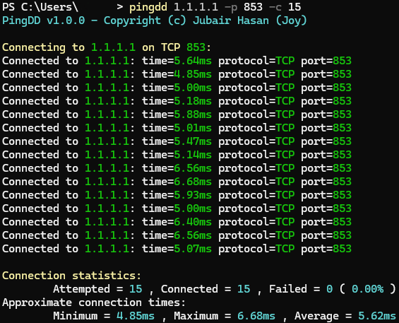

<p align="center">
  
</p>

# PingDD

**PingDD** is a cross-platform ping tool made in C for TCP port checking. This tool is designed to help network administrators and enthusiasts test the availability and responsiveness of specific TCP ports on remote servers.

<p align="center">
  
</p>

## Installation

### Installation on Windows

#### Winget

This tool can be downloaded using [Winget](https://learn.microsoft.com/en-us/windows/package-manager/).

[Winget](https://learn.microsoft.com/en-us/windows/package-manager/) will automatically install this tool and add it to [%PATH%](https://en.wikipedia.org/wiki/PATH_(variable)).

```bash
winget install -e --id DarthDemono.PingDD
```

### Installation on Linux

#### Compilation from Source

- This tool can be compiled from source if your Operating System is not available in the release. 

```bash
git clone https://github.com/darthdemono/pingdd.git
cd pingdd
make clean
make
```

- Then it can be added to [%PATH%](https://en.wikipedia.org/wiki/PATH_(variable)).
  - [Follow this tutorial, if you don't know how to do it.](https://www.sysadmit.com/2016/06/linux-anadir-ruta-al-path.html)

## Usage 

```bash
pingdd <hostname> -p <port> -c <time> -t [timeout]
```

- `hostname`: The address of the server you want to test.
- `port`: The TCP port you want to check.
- `time`: The amount of times port has to be pinged (Default infinite)
- `timeout` (optional): Timeout for the connection attempt in milliseconds.

### Example

```bash
pingdd example.com -p 80 -c 100
```

## Contributing

Contributions are welcome! Please open an issue or submit a pull request for any improvements or bug fixes.

## License

This project is licensed under the MIT License. See the [LICENSE](LICENSE) file for details.